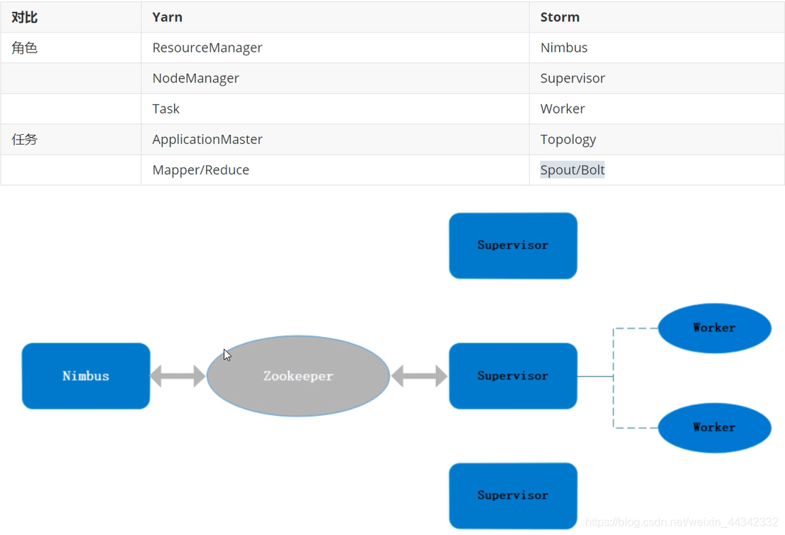
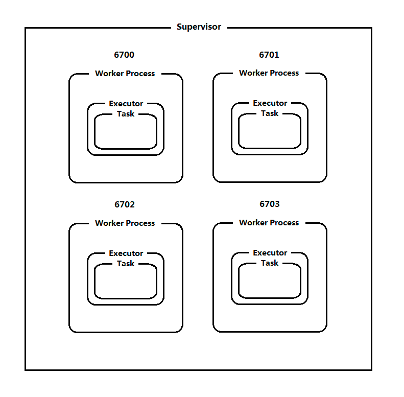
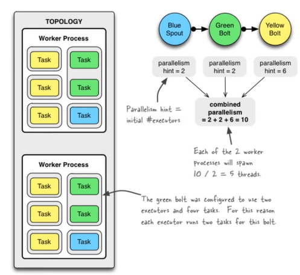
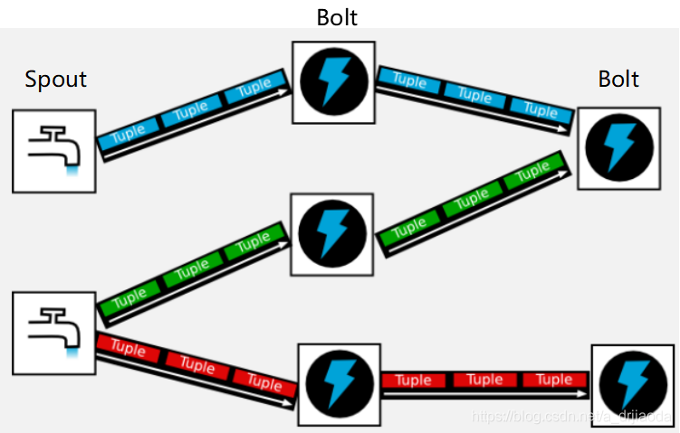
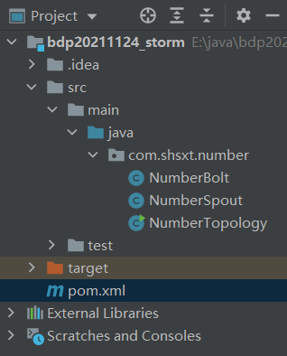
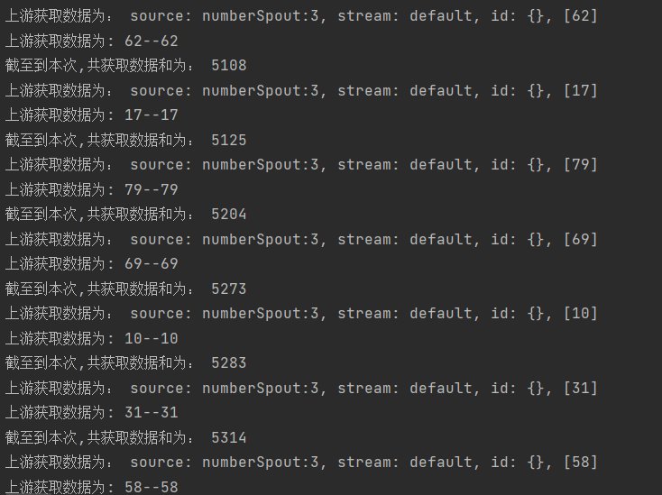
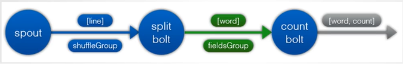

# Storm

## 1.DAG

有向无环图

## 2. Storm介绍

### 2.1.Storm简介

大数据实时处理解决方案（流计算）的应用日趋广泛，目前已是分布式技术领域最新爆发点，而Storm更是流计算技术中的主流。

### 2.2.Storm的优点

- storm使用netty传送消息，消除了中间的排队过程，是消息能够直接在任务自身之间流动。在消息的背后是一种用于序列化和反序列化Storm的原语类型的自动化且高效的机制。
- storm实现了有保障的消息处理，所以每个元组都会通过该拓扑结构进行全面处理。
- 如果一个元组还未处理会自动从spout处重发，storm还实现了任务级的故障检查，在一个任务发生故障时，消息会自动重新分配以快速重新开始处理。

### 2.3.Storm的特性

- 使用场景广泛

　　　　可以实时处理消息和更新DB

　　　　对一个耗资源的查询做实时并行化的处理

- 可伸缩性高

　　　　可以让storm每秒可以用处理的消息量达到很高

　　　　使用zookeeper来协调集群内的各种配置使得storm的集群可以很容易扩展。

- 保证无数据丢失

　　　　保证每一条消息都会被处理

- 异常健壮

　　　　容易管理，轮流重启节点不影响应用。

- 容错性好

　　　　在消息处理过程中出现异常，storm会进行重试

- 语言无关性

　　　　topology和消息处理组件（bolt）可以用任何语言来定义，这一点使得任何人都可以使用storm。

## 3. Storm的物理结构



### 3.1.Nimbus

- Storm的Master，负责资源分配和任务调度，一个Storm集群只有一个Nimbus。
- 集群的主节点，对整个集群的资源使用情况进行管理。
- 但是nimbus是一个无状态的节点，所有的一切都储存在Zookeeper.

### 3.2.Supervisor

- Storm的Slave，负责接收Nimbus分配的任务，管理说有的Worker。
- 一个Supervisor节点中包含多个Worker进程。默认是4个
- 一般情况下一个topology对应一个worker。

### 3.3.Worker

- 工作进程（Process），每个工作进程中都有多个Task。

### 3.4.Task

- 在Storm集群中每个Spout和Bolt都由若干个任务（tasks）来执行。
- worker（进程）中没一个spout/bolt的线程称为一个task
- 同一个spout/bolt的task可能会共享一个物理线程，该线程称为executor

### 3.5.Storm的并行机制

- Topology由一个或多个Spout/Bolt组件构成，运行中的Topology由一个或多个Supervisor节点中的Worker构成
- 默认情况下一个Supervisor节点运行4个worker，由defaults.yaml/storm.yaml中的属性决定。
- worker未特定拓扑的一个或多个组件spout/bolt产生一个或多个executor，默认情况下一个worker运行一个executor
- Executor为特定拓扑的一个或多个组件Spout/Bolt实例运行一个或多个Task，默认情况下一个Executor运行一个task。



### 3.6. 配置拓扑的并行度

-  工作进程Worker数量  

```java
//注意此参数不能大于supervisor.slots.ports数量。
Config config = new Config();
config.setNumWorkers(3);  
```

-  执行器Executor数量

```java
TopologyBuilder builder = new TopologyBuilder();
//设置Spout的Executor数量参数parallelism_hint
builder.setSpout(id, spout, parallelism_hint);   
//设置Bolt的Executor数量参数parallelism_hint
builder.setBolt(id, bolt, parallelism_hint);     
```

-  任务Task数量

```java
TopologyBuilder builder = new TopologyBuilder();
//设置Spout的Executor数量参数parallelism_hint，Task数量参数val
builder.setSpout(id, spout, parallelism_hint).setNumTasks(val); 
//设置Bolt的Executor数量参数parallelism_hint，Task数量参数val
builder.setBolt(id, bolt, parallelism_hint).setNumTasks(val);       
```



## 4. Storm的计算架构

- 流式计算框架
  - 客户端将数据发送给MQ（消息队列）然后传递到Storm中进行计算
  - 最终计算的结果储存到数据库中（HBase，Mysql）
  - 客户端不要求服务器返回结果，客户端可以一直向storm发送数据。
  - 客户端相当于生产者，storm相当于消费者。

### 4.1.Topology

- 计算拓扑
- storm的拓扑式对实时计算应用逻辑的封装，它的作用与MapReduce的任务（job）和相似，区别在于MapReduce的一个job在得到结果之后总会结束，而拓扑会一直在集群中运行，直到你手动去终止它。
- 拓扑还可以理解成有一系列通过数据流（steam grouping）相互关联的spout和bolt组成的拓扑结构。

### 4.2.Stream

- 数据流（streams）是storm中最核心的抽象概念。
- 一个数据流指的是分布式环境中并行创建、处理的一组元组（tuple）的无界序列。
- 数据流可以由一种能够表述数据流中元组的域（fields）的模式来定义。

### 4.3.Tuple

- Stream中最小数据组成单元
- 每个tuple可以包含多列，字段类型可能是：integer、long、short、byte、double、float、boolean和byte array

### 4.4.Spout

- 数据源是拓扑中数据流的来源。
- 一般spout会从一个外部的数据源读取元组然后将他们发送到拓扑中。

- 根据需求的不同, Spout既可以定义为可靠的数据源,也可以定义为不可靠的数据源。

- 一个可靠的Spout能够在它发送的元组处理失败时重新发送该元组,以确保所有的元组都能得到正确的处理;
  - storm在检测到一个tuple被整个topology成功处理的时候调用ack,否则调用fail.

- 不可靠的Spout就不会在元组发送之后对元组进行任何其他的处理。

- 一个Spout可以发送多个数据流。

### 4.5. Bolt

- 拓扑中所有的数据处理均是由Bolt完成的。
- 通过数据过滤(filtering)、函数处理(functions) 、聚合(aggregations) 、联结(joins) 、数据库交互等功能
- 一个Bolt可以实现简单的数据流转换,而更复杂的数据流变换通常需要使用多个Bolt并通过多个步骤完成。
- 第一级Bolt的输出可以作为下一级Bolt的输入。而Spout不能有上一级。
- Bolt几乎能够完成任何一种数据处理需求。



### 4.6. Stream Group

- 为拓扑中的每个Bolt的确定输入数据流是定义一个拓扑的重要环节。
- 数据流分组定义了在Bolt的不同任务(tasks)中划分数据流的方式。在Storm中有八种内置的数据流分组方式

### 4.7. Reliability

- 可靠性
- storm可以通过拓扑来确保每个发送的元组都能得到正确处理。
- 通过跟踪由Spout发出的每个元组构成的元组树可以确定元组是否已经完成处理。
- 每个拓扑都有一个"消息延时"参数,如果Storm在延时时间内没有检测到元组是否处理完成,就会将该元组标记为处理失败,并会在稍后重新发送该元组。

## 5. Storm之NumberCount

新建一个maven项目



- pom.xml

```xml
<?xml version="1.0" encoding="UTF-8"?>

<project xmlns="http://maven.apache.org/POM/4.0.0" xmlns:xsi="http://www.w3.org/2001/XMLSchema-instance"
  xsi:schemaLocation="http://maven.apache.org/POM/4.0.0 http://maven.apache.org/xsd/maven-4.0.0.xsd">
  <modelVersion>4.0.0</modelVersion>

  <groupId>com.shsxt</groupId>
  <artifactId>bdp20211124_storm</artifactId>
  <version>1.0-SNAPSHOT</version>

  <name>bdp20211124_storm</name>
  <!-- FIXME change it to the project's website -->
  <url>http://www.example.com</url>

  <properties>
    <project.build.sourceEncoding>UTF-8</project.build.sourceEncoding>
    <maven.compiler.source>1.8</maven.compiler.source>
    <maven.compiler.target>1.8</maven.compiler.target>
  </properties>

  <dependencies>
    <dependency>
      <groupId>junit</groupId>
      <artifactId>junit</artifactId>
      <version>4.11</version>
      <scope>test</scope>
    </dependency>
    <!-- https://mvnrepository.com/artifact/org.apache.storm/storm-core -->
    <dependency>
      <groupId>org.apache.storm</groupId>
      <artifactId>storm-core</artifactId>
      <version>0.10.0</version>
      <scope>${provided.scope}</scope>
    </dependency>

  </dependencies>


</project>
```

- com.shsxt.number.NumberTopology

```java
package com.shsxt.number;

import backtype.storm.Config;
import backtype.storm.LocalCluster;
import backtype.storm.generated.StormTopology;
import backtype.storm.topology.TopologyBuilder;

public class NumberTopology {

    public static void main(String[] args) {
        //创建任务的拓扑图
        TopologyBuilder topologyBuilder = new TopologyBuilder();
        //设置拓扑关系（Spout)
        topologyBuilder.setSpout("numberSpout",new NumberSpout());
        //设置拓扑关系(Bolt)
        topologyBuilder.setBolt("number1",new NumberBolt()).shuffleGrouping("numberSpout");

        //启动Togology
        Config conf = new Config();
        //创建一个togology
        StormTopology topology = topologyBuilder.createTopology();
        //本地模式启动集群
        LocalCluster localCluster = new LocalCluster();
        localCluster.submitTopology("numberTopology",conf,topology);

    }
}
```

- com.shsxt.number.NumberSpout

```java
package com.shsxt.number;

import backtype.storm.spout.SpoutOutputCollector;
import backtype.storm.task.TopologyContext;
import backtype.storm.topology.OutputFieldsDeclarer;
import backtype.storm.topology.base.BaseRichSpout;
import backtype.storm.tuple.Fields;
import backtype.storm.tuple.Values;

import java.util.Map;

public class NumberSpout extends BaseRichSpout{

    //声明一个SpoutOutputCollector对象，用于发送数据
    private SpoutOutputCollector collector;

    /**
     * 当我们执行任务的时候，用于初始化对象
     * @param conf
     * @param context
     * @param collector
     */
    @Override
    public void open(Map conf, TopologyContext context, SpoutOutputCollector collector) {
        //获取初始化的发送器
        this.collector = collector;
    }

    /**
     * 重复调用这个方法从源数据获取一条记录
     * 我们根据业务需求进行封装，然后通过SpoutOutputCollector发送给下一个Bolt
     */
    @Override
    public void nextTuple() {
        //随机生成一个100以内数字 
        int number = (int) (Math.random()*101);
        //将数据发送给下一个Bolt
        this.collector.emit(new Values(number));
        try {
            //限制传输速度 1s传一个
            Thread.sleep(1000);
        } catch (InterruptedException e) {
            e.printStackTrace();
        }
    }

    /**
     * 定义你输出值的属性
     * @param declarer
     */
    @Override
    public void declareOutputFields(OutputFieldsDeclarer declarer) {
        declarer.declare(new Fields("num"));
    }
}

```

- com.shsxt.number.NumberBolt

```java
package com.shsxt.number;

import backtype.storm.topology.BasicOutputCollector;
import backtype.storm.topology.OutputFieldsDeclarer;
import backtype.storm.topology.base.BaseBasicBolt;
import backtype.storm.tuple.Tuple;

public class NumberBolt extends BaseBasicBolt{

    //声明一个统计器
    private static int count;

    /**
     * 处理数据的业务逻辑
     * @param input
     * @param collector
     */
    @Override
    public void execute(Tuple input, BasicOutputCollector collector) {
        System.out.println("上游获取数据为： " + input);
        System.out.println("上游获取数据为: "+ input.getInteger(0)+"--"+ input.getIntegerByField("num"));
        count += input.getInteger(0);
        System.out.println("截至到本次,共获取数据和为： "+count);
    }

    /**
     * 如果需要向下传递数据，需要提前定义数据的格式
     * @param declarer
     */
    @Override
    public void declareOutputFields(OutputFieldsDeclarer declarer) {

    }
}
```

运行结果：



## 6.Storm的数据分发策略

1. Shuffle Grouping 

   随机分组，随机派发stream里面的tuple，保证每个bolt task接收到的tuple数目大致相同。 轮询，平均分配

2. Fields Grouping 

   按字段分组，比如，按"user-id"这个字段来分组，那么具有同样"user-id"的 tuple 会被分到相同的Bolt里的一个task， 而不同的"user-id"则可能会被分配到不同的task。

3. All Grouping 

   广播发送，对于每一个tuple，所有的bolts都会收到

4. Global Grouping 

   全局分组，把tuple分配给task id最低的task 。

5. None Grouping 

   不分组，这个分组的意思是说stream不关心到底怎样分组。目前这种分组和Shuffle grouping是一样的效果。 有一点不同的是storm会把使用none grouping的这个bolt放到这个bolt的订阅者同一个线程里面去执行（未来Storm如果可能的话会这样设计）。

6. Direct Grouping 

   指向型分组， 这是一种比较特别的分组方法，用这种分组意味着消息（tuple）的发送者指定由消息接收者的哪个task处理这个消息。只有被声明为 Direct Stream 的消息流可以声明这种分组方法。而且这种消息tuple必须使用 emitDirect 方法来发射。消息处理者可以通过 TopologyContext 来获取处理它的消息的task的id (OutputCollector.emit方法也会返回task的id)

7. Local or shuffle grouping 

  本地或随机分组。如果目标bolt有一个或者多个task与源bolt的task在同一个工作进程中，tuple将会被随机发送给这些同进程中的tasks。否则，和普通的Shuffle Grouping行为一致 customGrouping 自定义，相当于mapreduce那里自己去实现一个partition一样。

8. customGrouping

   自定义，相当于mapreduce那里自己去实现一个partition一样。

- 分区策略的测试

```java
topologyBuilder.setBolt("AllBolt",new AllBolt(),2).allGrouping("GroupSpout");
```

> AllBolt:[com.shsxt.group.AllBolt@7169f7c9:]source: GroupSpout:3, stream: default, id: {}, [1, cc]
> AllBolt:[com.shsxt.group.AllBolt@4a8d78b6:]source: GroupSpout:3, stream: default, id: {}, [1, cc]
> AllBolt:[com.shsxt.group.AllBolt@7169f7c9:]source: GroupSpout:3, stream: default, id: {}, [2, aa]
> AllBolt:[com.shsxt.group.AllBolt@4a8d78b6:]source: GroupSpout:3, stream: default, id: {}, [2, aa]
> AllBolt:[com.shsxt.group.AllBolt@7169f7c9:]source: GroupSpout:3, stream: default, id: {}, [3, bb]
> AllBolt:[com.shsxt.group.AllBolt@4a8d78b6:]source: GroupSpout:3, stream: default, id: {}, [3, bb]
> AllBolt:[com.shsxt.group.AllBolt@7169f7c9:]source: GroupSpout:3, stream: default, id: {}, [4, cc]
> AllBolt:[com.shsxt.group.AllBolt@4a8d78b6:]source: GroupSpout:3, stream: default, id: {}, [4, cc]
> AllBolt:[com.shsxt.group.AllBolt@7169f7c9:]source: GroupSpout:3, stream: default, id: {}, [5, aa]
> AllBolt:[com.shsxt.group.AllBolt@4a8d78b6:]source: GroupSpout:3, stream: default, id: {}, [5, aa]
> AllBolt:[com.shsxt.group.AllBolt@7169f7c9:]source: GroupSpout:3, stream: default, id: {}, [6, bb]
> AllBolt:[com.shsxt.group.AllBolt@4a8d78b6:]source: GroupSpout:3, stream: default, id: {}, [6, bb]

```java
topologyBuilder.setBolt("FieldsBolt",new FieldsBolt(),3).fieldsGrouping("GroupSpout",new Fields("word"));
```

> FieldsBolt:[com.shsxt.group.FieldsBolt@1cd02e8d:]source: GroupSpout:4, stream: default, id: {}, [0, bb]
> FieldsBolt:[com.shsxt.group.FieldsBolt@48ad00ad:]source: GroupSpout:4, stream: default, id: {}, [1, cc]
> FieldsBolt:[com.shsxt.group.FieldsBolt@5b949c7d:]source: GroupSpout:4, stream: default, id: {}, [2, aa]
> FieldsBolt:[com.shsxt.group.FieldsBolt@1cd02e8d:]source: GroupSpout:4, stream: default, id: {}, [3, bb]
> FieldsBolt:[com.shsxt.group.FieldsBolt@48ad00ad:]source: GroupSpout:4, stream: default, id: {}, [4, cc]
> FieldsBolt:[com.shsxt.group.FieldsBolt@5b949c7d:]source: GroupSpout:4, stream: default, id: {}, [5, aa]
> FieldsBolt:[com.shsxt.group.FieldsBolt@1cd02e8d:]source: GroupSpout:4, stream: default, id: {}, [6, bb]
> FieldsBolt:[com.shsxt.group.FieldsBolt@48ad00ad:]source: GroupSpout:4, stream: default, id: {}, [7, cc]
> FieldsBolt:[com.shsxt.group.FieldsBolt@5b949c7d:]source: GroupSpout:4, stream: default, id: {}, [8, aa]
> FieldsBolt:[com.shsxt.group.FieldsBolt@1cd02e8d:]source: GroupSpout:4, stream: default, id: {}, [9, bb]
> FieldsBolt:[com.shsxt.group.FieldsBolt@48ad00ad:]source: GroupSpout:4, stream: default, id: {}, [10, cc]
> FieldsBolt:[com.shsxt.group.FieldsBolt@5b949c7d:]source: GroupSpout:4, stream: default, id: {}, [11, aa]
> FieldsBolt:[com.shsxt.group.FieldsBolt@1cd02e8d:]source: GroupSpout:4, stream: default, id: {}, [12, bb]

```java
topologyBuilder.setBolt("ShuffleBolt",new ShuffleBolt(),3).shuffleGrouping("GroupSpout");
```

> ShuffleBolt:[com.shsxt.group.ShuffleBolt@4919faa0:]source: GroupSpout:1, stream: default, id: {}, [1, cc]
> ShuffleBolt:[com.shsxt.group.ShuffleBolt@1da5f071:]source: GroupSpout:1, stream: default, id: {}, [2, aa]
> ShuffleBolt:[com.shsxt.group.ShuffleBolt@3e452750:]source: GroupSpout:1, stream: default, id: {}, [3, bb]
> ShuffleBolt:[com.shsxt.group.ShuffleBolt@1da5f071:]source: GroupSpout:1, stream: default, id: {}, [4, cc]
> ShuffleBolt:[com.shsxt.group.ShuffleBolt@4919faa0:]source: GroupSpout:1, stream: default, id: {}, [5, aa]
> ShuffleBolt:[com.shsxt.group.ShuffleBolt@3e452750:]source: GroupSpout:1, stream: default, id: {}, [6, bb]
> ShuffleBolt:[com.shsxt.group.ShuffleBolt@4919faa0:]source: GroupSpout:1, stream: default, id: {}, [7, cc]
> ShuffleBolt:[com.shsxt.group.ShuffleBolt@1da5f071:]source: GroupSpout:1, stream: default, id: {}, [8, aa]
> ShuffleBolt:[com.shsxt.group.ShuffleBolt@1da5f071:]source: GroupSpout:1, stream: default, id: {}, [9, bb]
> ShuffleBolt:[com.shsxt.group.ShuffleBolt@3e452750:]source: GroupSpout:1, stream: default, id: {}, [10, cc]
> ShuffleBolt:[com.shsxt.group.ShuffleBolt@4919faa0:]source: GroupSpout:1, stream: default, id: {}, [11, aa]
> ShuffleBolt:[com.shsxt.group.ShuffleBolt@3e452750:]source: GroupSpout:1, stream: default, id: {}, [12, bb]
> ShuffleBolt:[com.shsxt.group.ShuffleBolt@4919faa0:]source: GroupSpout:1, stream: default, id: {}, [13, cc]
> ShuffleBolt:[com.shsxt.group.ShuffleBolt@1da5f071:]source: GroupSpout:1, stream: default, id: {}, [14, aa]
> ShuffleBolt:[com.shsxt.group.ShuffleBolt@1da5f071:]source: GroupSpout:1, stream: default, id: {}, [15, bb]

## 7.Storm之WordCount

storm任务从数据源每次读取一个完整的英文句子，将这个句子分解为独立的单词，最后，实时的输出每个单词以及它出现过的次数。



- com.shsxt.wordcount.WordCountTopology

```java
package com.shsxt.wordcount;

import backtype.storm.Config;
import backtype.storm.LocalCluster;
import backtype.storm.generated.StormTopology;
import backtype.storm.topology.TopologyBuilder;
import backtype.storm.tuple.Fields;


public class WordCountTopology {

    public static void main(String[] args) {
        //创建任务的拓扑图
        TopologyBuilder topologyBuilder = new TopologyBuilder();
        //设置拓扑关系（Spout)
        topologyBuilder.setSpout("WordCountSpout",new WordCountSpout());
        //设置拓扑关系(Bolt)---切分行
        topologyBuilder.setBolt("LineSplitBolt",new LineSplitBolt(),2).shuffleGrouping("WordCountSpout");
        //设置拓扑关系(Bolt)---对单词数量进行统计，这里不能用shuffleGrouping，否则统计会出错
//        topologyBuilder.setBolt("WordCountBolt",new WordCountBolt(),4).shuffleGrouping("LineSplitBolt");
        topologyBuilder.setBolt("WordCountBolt",new WordCountBolt(),4).fieldsGrouping("LineSplitBolt",new Fields("word"));

        //启动Togology
        Config conf = new Config();
        //创建一个togology
        StormTopology topology = topologyBuilder.createTopology();
        //本地模式启动集群
        LocalCluster localCluster = new LocalCluster();
        localCluster.submitTopology("WordCountTopology",conf,topology);

    }
}

```

- com.shsxt.wordcount.WordCountSpout

```java
package com.shsxt.wordcount;

import backtype.storm.spout.SpoutOutputCollector;
import backtype.storm.task.TopologyContext;
import backtype.storm.topology.OutputFieldsDeclarer;
import backtype.storm.topology.base.BaseRichSpout;
import backtype.storm.tuple.Fields;
import backtype.storm.tuple.Values;

import java.util.Map;
import java.util.Random;

public class WordCountSpout extends BaseRichSpout{

    //声明一个SpoutOutputCollector对象，用于发送数据
    private SpoutOutputCollector collector;
    //首先创建一个数组存放要发送的数据
    private String[] array = {
            "Look I really sorry about that telephone call",
            "I hope it is not too long",
            "I do hope you are all right"
    };
    //创建Random对象
    private Random random = new Random();
    /**
     * 当我们执行任务的时候，用于初始化对象
     * @param conf
     * @param context
     * @param collector
     */
    @Override
    public void open(Map conf, TopologyContext context, SpoutOutputCollector collector) {
        //获取初始化的发送器
        this.collector = collector;
    }

    /**
     * 重复调用这个方法从源数据获取一条记录
     * 我们根据业务需求进行封装，然后通过SpoutOutputCollector发送给下一个Bolt
     */
    @Override
    public void nextTuple() {
        //获取本次要发送的字符串
        String line = array[random.nextInt(array.length)];
        //将数据发送给下一个Bolt
        System.out.println("本次发送的数据："+line);
        this.collector.emit(new Values(line));
        try {
            //限制传输速度 1s传一个
            Thread.sleep(1000);
        } catch (InterruptedException e) {
            e.printStackTrace();
        }
    }

    /**
     * 定义你输出值的属性
     * @param declarer
     */
    @Override
    public void declareOutputFields(OutputFieldsDeclarer declarer) {
        declarer.declare(new Fields("line"));
    }
}
```

- com.shsxt.wordcount.WordSplitBolt

```java
package com.shsxt.wordcount;

import backtype.storm.topology.BasicOutputCollector;
import backtype.storm.topology.OutputFieldsDeclarer;
import backtype.storm.topology.base.BaseBasicBolt;
import backtype.storm.tuple.Fields;
import backtype.storm.tuple.Tuple;
import backtype.storm.tuple.Values;

public class LineSplitBolt extends BaseBasicBolt{


    /**
     * 处理数据的业务逻辑
     * @param input
     * @param collector
     */
    @Override
    public void execute(Tuple input, BasicOutputCollector collector) {
        //首先获取到一行数据
        String line=input.getStringByField("line");
        System.out.println("接收到line为"+line);

        //对line进行切分
        if(line!=null&&line.length()>0){
            // 用空格切分
            String[] words = line.split(" ");
            // 发送到下一个Bolt
            for (String word : words) {
                //继续向后发送数据
                collector.emit(new Values(word));
            }
        }
    }

    /**
     * 如果需要向下传递数据，需要提前定义数据的格式
     * @param declarer
     */
    @Override
    public void declareOutputFields(OutputFieldsDeclarer declarer) {
        declarer.declare(new Fields("word"));
    }
}
```

- com.shsxt.wordcount.WordCountBolt

```java
package com.shsxt.wordcount;

import backtype.storm.topology.BasicOutputCollector;
import backtype.storm.topology.OutputFieldsDeclarer;
import backtype.storm.topology.base.BaseBasicBolt;
import backtype.storm.tuple.Tuple;

import java.util.HashMap;
import java.util.Map;

public class WordCountBolt extends BaseBasicBolt{

    //声明一个map来存放以前的统计结果
    private Map<String,Integer> map=new HashMap<>();

    /**
     * 处理数据的业务逻辑
     * @param input
     * @param collector
     */
    @Override
    public void execute(Tuple input, BasicOutputCollector collector) {
        // 获取单词
        String word=input.getStringByField("word");
        // 判断这个单词是否在map里
        if(map.containsKey(word)){
            // 最新统计的数量为
            int count=map.get(word)+1;
            // 重新设置到map
            map.put(word,count);
        }else{
            // 将新单词放进map
            map.put(word,1);
        }
        System.out.println(this+"本次执行完，单词"+word+"的数量为："+map.get(word));
    }

    /**
     * 如果需要向下传递数据，需要提前定义数据的格式
     * @param declarer
     */
    @Override
    public void declareOutputFields(OutputFieldsDeclarer declarer) {


    }
}
```
